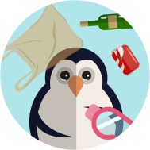

#SALVAR A MARIANO

[Click aquí para jugar](https://uriel-gartzia.github.io/Salvad-a-Mariano/)

##DESCRIPCIÓN

"Salvar a Mariano" es un sencillo videojuego protagonizado por un pingüino llamado Mariano que trata de sobrevivir en un mar contaminado y lleno de basura. 

##PRINCIPALES FUNCIONALIDADES

- Collision
- Game Win
- Game Over
- Garbage Spawning
- Garbage Dissapear
- Life
- Mariano´s Gravity
- Mariano´s movement
- Timer countdown

##FUTURAS FUNCIONALIDADES

- Fishes spawning
- Fishes dissapear
- Más dificultad

##TECNOLOGÍAS USADAS

He usado HTML, CSS, Javascript, manipulación de DOM, almacenaje local.

##STATES

- Pantalla inicial
- Pantalla del juego
- Pantalla Game Win
- Pantalla Game Over

##PROYECT STRUCTURE

###main.js

- Startgame
- Lose restart game
- Win restart game

###game.js

- 

###Mariano.js
- Gravity
- Position Updates

###garbage.js
- AutoMov
- PositionUpdate
- Remove garbage

###life.js
- remove life

